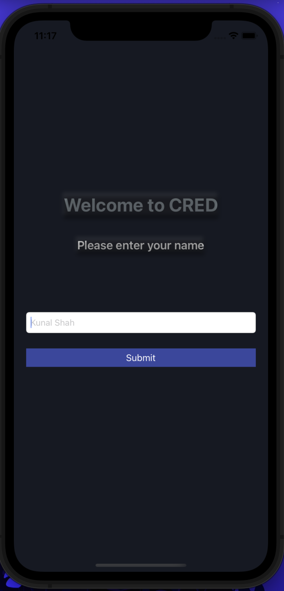
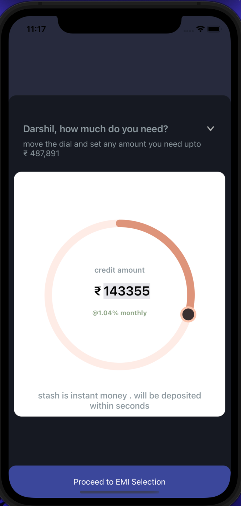
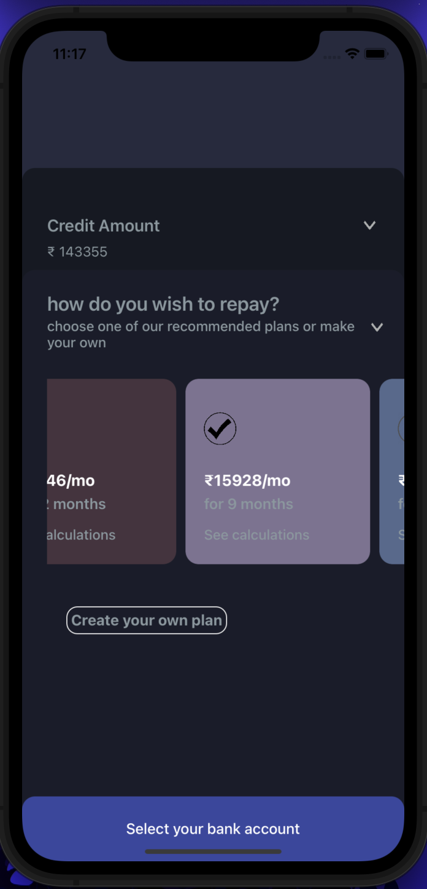
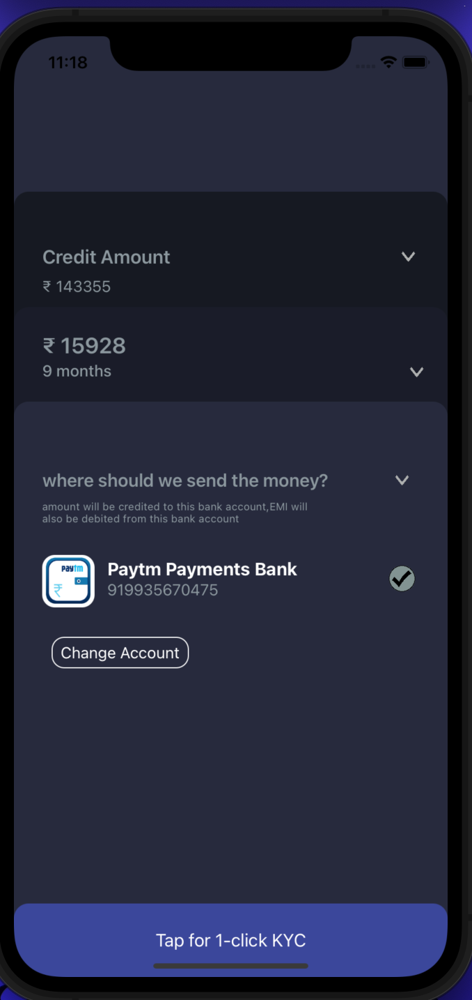

# CRED-Submission
My Problem Statement Submission for Cred iOS Developer role
On Your Local Environment run the command "pod install" in terminal for setup.
Hereby Attaching Screenshots.

 ||  || ||   
